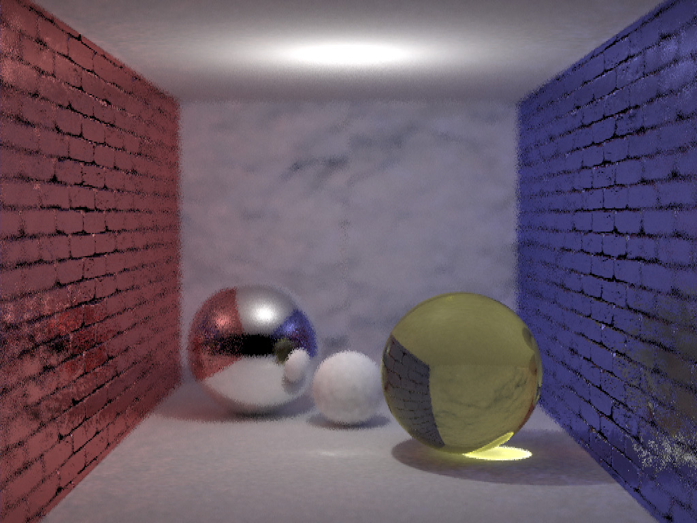
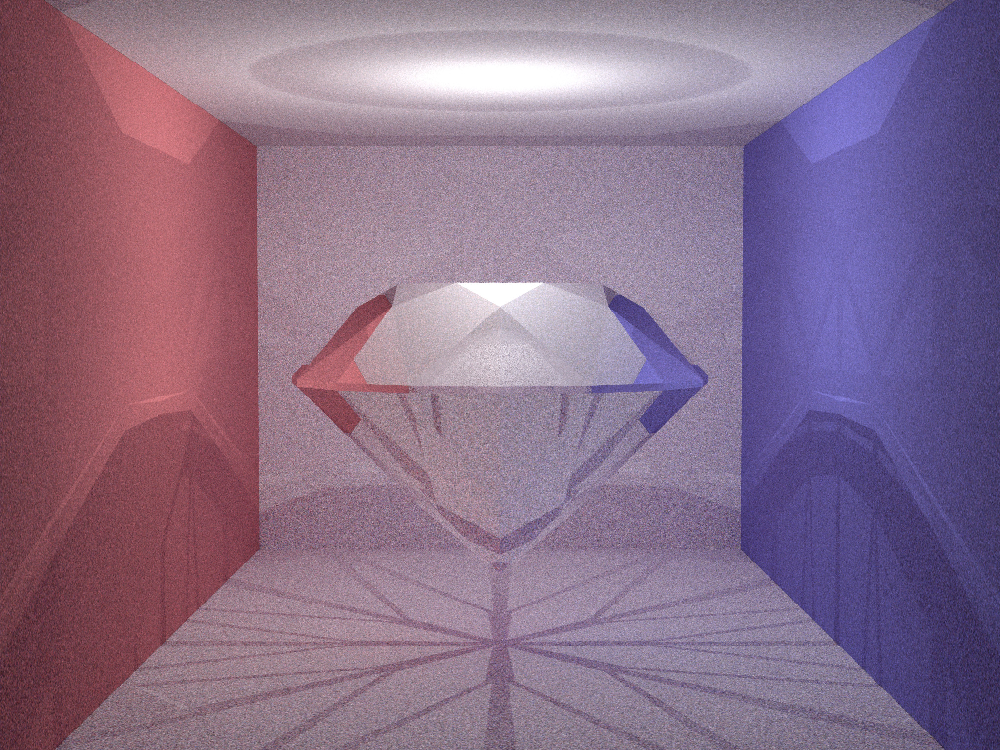
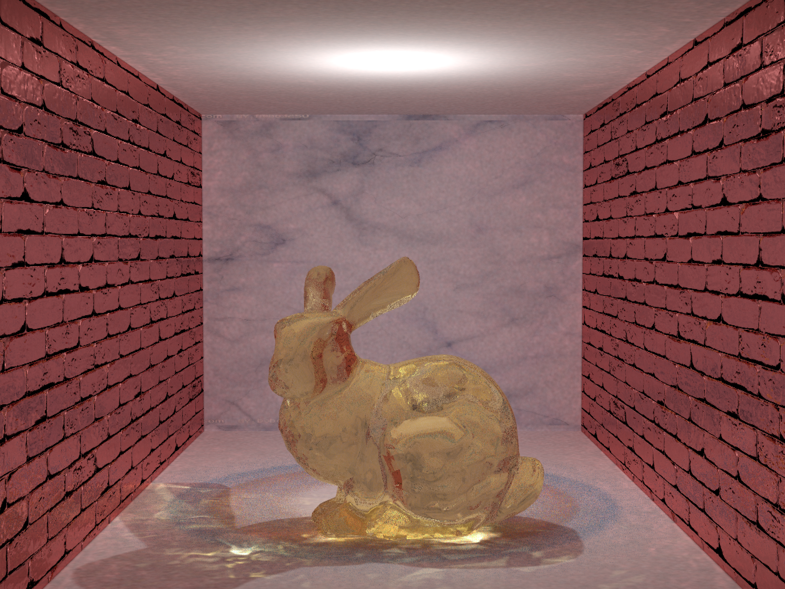
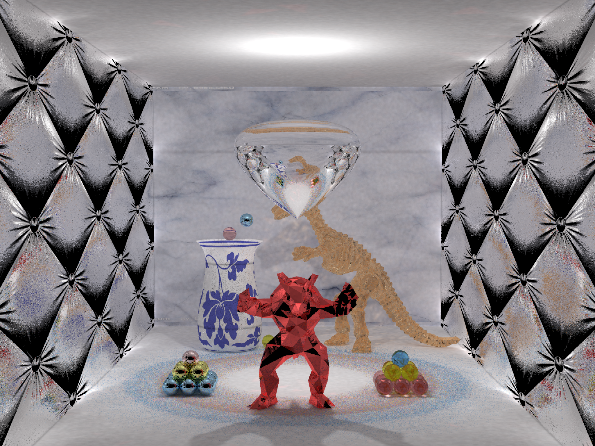

# README
[](https://github.com/Aaronepower/tokei)			
本项目是[胡事民教授](https://cg.cs.tsinghua.edu.cn/shimin.htm)的清华大学交叉信息研究院专业课《高等计算机图形学》课程大作业，实现了支持复杂网格模型（含包围球加速、KD-Tree 算法加速、多线程求交加速、法向插值）、Bezier 旋转曲面（含包围盒加速、系数预处理加速）、平面以及球面的光线追踪引擎。其中光线追踪部分采用了 Progressive Photon Mapping 算法（渐进式光子映射），支持了 Hash Grid 加速。除此之外，通过对结果图像的进一步处理，本项目实现了色散效果、图片去噪以及超采样。报告将按照从核心代码到附加功能的顺序分为多个章节。

代码结构如下：

* `main.cpp`: 主函数，用来设置相机参数，初始化场景参数以及光线追踪引擎。
* `monitors/manager.h` & `monitors/manager.cpp`: 提供了 PPM 算法所需要的设施，并且包含了主控代码。
* `utils/utils.h` & `utils/utils.cpp`: 提供了大量数据结构以及工具性函数。
* `utils/texture.h` & `utils/texture.cpp`: 提供了纹理贴图所需要的函数（封装为 `Texture` 类）。
* `utils/normal_texture.h` & `utils/normal_texture.cpp`: 提供了纹理贴图所需要的函数（封装为 `NormalTexture` 类）。
* `objects/sphere.h` & `objects/sphere.cpp`: 实现了球面的初始化、求交以及UV坐标（封装为 `Sphere` 类）。
* `objects/plane.h` & `objects/plane.cpp`: 实现了平面的初始化以及求交（封装为 `Plane` 类）。
* `objects/triangle.h`: 实现了三角面片的初始化以及求交（封装为 `Triangle` 类）。
* `objects/bezier2D.h`: 实现了平面上 Bezier 曲线的初始化以及求交（封装为 `Bezier2D` 类）。
* `objects/bezierObject.h`: 实现了 Bezier 旋转曲面的初始化、求交以及UV坐标（封装为 `Bezier3D` 类）。
* `objects/kdTree.h` & `objects/kdTree.cpp`: 实现了用于加速网格曲面求交的 KD-Tree 算法以及数据结构（封装为 `KDTree` 类）。
* `objects/mesh.h` & `objects/mesh.cpp`: 实现了网格曲面的初始化、快速求交以及法向插值（封装为 `Mesh` 类）。
* `run.sh`: 使用 cmake 编译的 shell 脚本。
* `dipersion.py`: 结果图像后期实现色散代码。
* `antiNoising.py`: 图片后期去噪以及超采样代码。 

## Progressive Photon Mapping

PPM 的代码参考了 [smallppm](https://cs.uwaterloo.ca/~thachisu/smallppm_exp.cpp)，这是一个基于 smallpt 的简单光子映射渲染器，但是存在大量错误，在我的代码中都已经得到修复（例如漫反射没有实现 color bleeding）。具体而言，PPM 是一个 Two-Phased 的算法，第一个 Phase 类似于 Ray Tracing，从像素点发出射线，让光线在场景中进行反射以及折射的迭代，最后落在一个漫反射表面上。同时程序会将交点以及其他一些信息存储下来，利用 Hash Grid 进行组织，可以快速查询以及修改。这一部分代码实现在 `monitors/manager` 的 `measure` 函数当中。

第二阶段程序将会从光源发出光子（`monitor/manager` 的 `generatePhoton` 函数），同样让光线在场景中进行反射以及折射的迭代，最后落在一个漫反射表面上并选取一个随机的方向继续前进。当光子打在漫反射表面上的时候，我们需要根据在一个阶段的交点信息来估计现在的交点附近的光强贡献并存储在 Hash Grid 当中。这一部分（`monitors/manager` 的 `trace` 函数）我利用 `openMP` 进行了**并行化加速**，在我的设备（CPU: i7-8750h (6C12T), RAM: 16GB with 8GB swap space, ROM: 1TB and 7200RPM machanic hard disk, SYSTEM: deepin 20.3）上运行时，能得到大约$10$倍的性能提升。这里性能提升不是$12$倍的原因是当图片分辨率过高时，我的机器没有足够的内存来存储所有的数据结构，需要使用到交换空间（Swap Space on Disk）导致会有一段时间的 I/O 操作。

值得注意的是，这里我们构造了一种新的材质 `MIXED`，对于一个物品上的每一个点以$0.1$的概率选择反射材质，以$0.9$的概率选择漫反射材质，这样可以让 `MIXED` 材质更加接近陶瓷。对于其他的材质，我的处理方法与 smallpt 类似，实现了反射、折射、漫反射以及折射的 Fresnel 效应，同样也采用了 Russian roulette 来在第一阶段遇到玻璃时选择反射或者折射。相比 KD-Tree，**Hash Grid** 在 PPM 算法当中能更高效的实现快速查找以及更新。

如下面的图片所示（分别对应球体、多边体和一般物体），相比普通的 Path Tracing 算法，PPM 算法呈现了非常精确清晰的焦散光斑。 

<table frame=void>
	<tr>
    <td><center></center></td>
    <td><center></center></td>
        <td><center></center></td>
    </tr>
</table>

## 复杂网格模型

复杂网格模型的主要代码在 `objects/mesh` 当中，除了必要的求交、模型读取等功能外，我还实现了**包围球加速**、**包围盒加速**、**KD-Tree 加速**、**多线程加速**以及**法向插值**的附加功能。下面两张图片中的钻石、恐龙以及穿山甲都是基于网格模型绘制的。

<table frame=void>
	<tr>
    <td><center></center></td>
    <td><center></center></td>
    </tr>
</table>

我的代码完全 OOP 化了，只需要调用 `intersect`、`getColor` 以及 `getNormal` 函数就可以得到实现各种光线追踪算法的必要信息。最基本的求交需要调用三角形的求交方法，代码参见 `objects/triangle.h`，使用了《计算机图形学基础教程》当中介绍的算法；最基本的法向计算则是直接求边向量的叉积。下面我将会分别介绍实现的附加功能和加速。

### 包围球加速

包围球加速是我复杂网格求交的第一层加速，它可以快速过滤掉一些光线，从而无需调用包围盒或者 KD-Tree。我的 `Mesh` 类继承了 `Sphere` 类，因此如果能够得到包围球，我们只需要调用父类的 `intersect` 函数就可以排除掉一些肯定不会和三角网格有交点的光线。计算包围球的算法采用 [Jack Ritter's algorithm](https://cn.wikichali.com/345656-bounding-sphere-JDVWPJ)。具体的算法如下所示：

```
1. Find the minimal X, Y, Z and the maximal X, Y, Z in all points and denote the corresponding points as minX, minY, minZ, maxX, max Y, maxZ.
2. Compute the distance between pairs minX and maxX, minY and maxY, minZ and maxZ.
3. Set the diameter of sphere to be the pair with largest distance.
4. For each point P, if P is out of the current sphere, move the center O of the sphere by |OP|-r towards P. 
```

在实际程序运行当中，包围球能带来巨大的性能提升，特别是网格模型绝对大小较小的时候。

### 包围盒加速

包围盒加速是我复杂网格求交的第二层加速，由于我实现了 KD-Tree 算法，这部分代码已经被注释了。这一部分我的思路非常简单，显而易见，包围盒本身也是一个网格模型，由$12$个三角面片组成，因此为了检测光线是否和包围盒相交，我们只需要判断光线是否和这$12$个三角形相交即可。

### KD-Tree 加速

KD-Tree 加速是我复杂网格求交的第三层加速，算法的实现参考了 [URL](https://github.com/xianyuggg/PathTracing-Renderer)。大体上的实现方法是将三角形面片分为一些区域，然后利用包围盒检测算法来判断光线是否和某一区域的三角形面片有交，这一算法的细节可以参见[维基百科](https://zh.wikipedia.org/wiki/K-d%E6%A0%91)，我的实现和上面的伪代码基本一致。注意到，这一算法可以将复杂度降低到$O(\log n)$左右，所以可以带来很大的性能提升，特别是三角形面片的数量较大时。另外注意到，我们的 KD-Tree 是在$\mathbb{R}^3$空间当中的，所以不会有维数灾难的问题，在实际运行当中，相比遍历求交 `bunny.obj` 有数十倍的提升。

为了简化算法并进一步加速，我在三角形和包围盒求交的时候，并没有选择计算精确的结果。实际上，我们只需要保证不存在“false negative”即可，因此可以直接找出三角形的包围盒，判断两个包围盒是否有交点。而两个包围盒有交点当且仅当有一个包围盒存在一个顶点在另一个包围盒当中，这是非常容易检验且快速的。相比求解精确的结果，这一方法可以带来数倍的性能提升，但不会产生很多误判，因为对于复杂网格模型，每个三角形本身占据的空间非常小。

### 多线程加速

在 KD-Tree 返回可能和光线有交点的三角形面片之后，我们需要遍历这些三角形并判断光线和三角形是否有交点。这一过程都是读操作，因此可以并行化，只需要在更新最近的交点到光源距离的时候设置一个“critical session”即可。

### 法向插值

对于提供了顶点处法向的模型，我实现了重心坐标插值。具体方法如下所示：

```
1. Compute the intersection point P
2. Compute the barycentric coordinates of P
	Sa = ||cross(B-P, C-P)||
	Sb = ||cross(A-P, C-P)||
	Sc = ||cross(A-P, B-P)||
3. Normal of P = normalize(Sa * normal of A + Sb * normal of B + Sc * normal of C)
```

这一方法可以较好的让模型比较光滑，是因为重新坐标是线性变化的，那么其经过的每一个位置都是均匀变化、平滑过渡的。下图是一只经过法向插值优化的斯坦福兔子，可以看到尽管三角形个数相比原版的兔子少了很多，渲染出的图像依然十分真实且光滑。


## Bezier 旋转曲面

这一部分的代码在 `objects/bezier2D.h` 和 `objects/bezierObject.h` 里面，大体上的实现方法是将一条 Bezier 曲线绕轴旋转构成曲面。下面图中的花瓶以及水滴都是通过这一方法得到的。

<table frame=void>
	<tr>
    <td><center></center></td>
    <td><center></center></td>
    </tr>
</table>

这一部分主要有两个功能需要实现，第一个是给定一个$t$，我们需要在 Bezier 曲线上找到对应的点；第二个则是给定一条光线，我们需要判断它和我们的曲面有没有交，交在什么地方。

第一个功能我参考了 [URL](https://github.com/Trinkle23897/Computational-Graphics-THU-2018/tree/master/hw2/report.pdf) 当中的介绍的算法。具体来说，由于 Bezier 曲线的$x,y$坐标是独立的，假设给定的$n+1$个数值为$f_0,f_1,\cdots,f_n$，$Q(f,t)$可以写成$\sum_{i=0}^nf_iB_{in}(t)=\sum_{i=0}^nf_i\binom{n}{i}t^i(1-t)^{n-i}$的形式，那么$(Q(x,t),Q(y,t))$就构成了参数曲线。进一步，函数$Q(f,t)$是一个关于$t$的$n$次多项式，所以我们可以在初始化的时候先将它的系数预处理出来，那么对于任意一个$t$，在 Bezier 曲线上对应的点以及该点的导数都可以在$O(n)$的时间内算出来。这大大缩短了求交以及求法向量的时间。

我第二个功能的实现有细微的问题，但总体上是完全正确的。事实上，我们显然有：某条射线与一个旋转 Bezier 曲面有交点，当且仅当存在某个垂直于旋转轴的平面上，射线与平面的交点到旋转轴的距离，等于旋转 Bezier 曲面与该平面的交点到旋转轴的距离。这样，我们就将问题转化为一个形如
$$
\sqrt{a(Q(y,t))^2+bQ(y,t)+c}=Q(x,t)
$$
的解方程问题。这一问题可以利用牛顿法非常容易的解决。事实上，我们可以将旋转轴划分为多个区间，然后在每个区间当中用一次牛顿法来判断光线和这一段当中的曲面是否有交点，与此同时，牛顿法的初始点也可以选取多个并运行多次来减少错误。这些都被我设定成为了可以进行调试的参数。上面的式子同样实现了**包围盒加速**，我们只需要事先判断左边的式子的最小值是否超过右边的最大值即可。唯一的问题在于，当光线垂直于旋转轴，并且 Bezier 曲线的导数接近$0$的时候，会有一些光线被当做垂直进入处理。这一问题比较难以解决，一种解决方法是提高数据的精度，但由于我的代码中都固定使用了 `double`，所以暂时没有处理。总体来说，求交是没有问题的，但在精度上存在一定改进空间。

旋转曲面的 UV 坐标是值得一提的，我们将$U$坐标设置为了旋转的角度，将$V$坐标设置为了参数$t$，这样一来，贴图在旋转曲面上将会是比较均匀的，特别对于花瓶花纹而言效果极佳。

## 附加功能

### 抗锯齿

这一功能的实现非常之简单，具体的代码在 `main.cpp` 当中，查找注释即可。一方面，我使用了 tent filter 来使物体边缘变得更加柔和；另一方面，开启抗锯齿的时候，将图片的长和宽设置为原来的两倍，并在写入图片的时候将每个$2\times 2$的像素块合并成为一个像素（颜色求平均），这样同样能使物体的边缘有一定的渐进。文档中的所有图片都是在开启了抗锯齿的情况下跑的。

### 软阴影

算法本身已经支持了软阴影效果，这一效果已经实现了。另外，tent filter 也进一步优化了软阴影的效果。

### 景深效果

这一部分也实现在了 `main.cpp` 当中。模拟光圈的基本思想是在距离物体距离等于焦距的平面上，所有点都应当是清晰可见的。我使用了传统的小孔成像相机来实现景深效果，对每一个像素找到相机和像素连线以及焦平面的交点（焦平面由焦距 `focalLength` 决定），然后将相机中心在直径为 `aperture` 的圆盘（光圈）内随机移动，最后再将交点和相机随机移动到的点连接作为一条光线（在 PPM 当中，就是第一个 phase 当中的一条探测光）。这样离焦平面越远的点，就会越模糊，于是就模拟出来了景深效果。在下面的两张图中，我的焦距分别位于花瓶和穿山甲所在的平面，可以看到，效果非常的明显。

<table frame=void>
	<tr>
    <td><center></center></td>
    <td><center></center></td>
    </tr>
</table>

### 纹理贴图和凹凸贴图

代码都在 `utils` 文件夹当中，这两个部分没有什么算法上的难度，我使用了 opencv 来读取纹理图片。其中纹理贴图根据 UV 坐标在图片上的对应位置返回颜色即可；而凹凸贴图略微复杂一点，需要根据目前物体上点的法向方向来确定改变之后的法向向量。具体来说，凹凸贴图文件用 RGB 颜色来存储当原本法向量为$(0,0,1)$时，每个点由于表面的粗糙性而产生的不同的法向量（当然，大部分还是接近于$(0,0,1)$，所以凹凸贴图文件一般会泛蓝）。然而物体上的一个点法向量原本不一定是$(0,0,1)$，这就需要对读取出来的法向量进行旋转，代码如下（此处是球面，所以偏导就是切线方向）：

```python
Vec directionX = Vec(point.y, -point.x, 0).norm();
    Vec directionY = directionX.cross(point).norm();
    directionY = directionY.z >= 0 ? directionY : directionY * (-1);
    u = fmod(u * zoom, 1);
    v = fmod(v * zoom, 1);
    Vec originalNormal =
            this->texture[int((this->width - int(u * this->width) - 1) * this->height + int(v * this->height))] * 2 -
            Vec(1, 1, 1);
    return (directionX * originalNormal.x + directionY * originalNormal.y +
            Vec(point.x, point.y, point.z).norm() * -1 * originalNormal.z).norm() * -1;
```

在景深一节的图片中，就已经包括了纹理贴图和凹凸贴图。其中花瓶使用了纹理贴图来实现花纹，背后的墙壁也通过纹理贴图实现了类似于瓷砖的效果，而左右两边的墙壁则通过凹凸贴图实现了抛光砖块的效果。

### 色散

我的色散实现比较简单，相比传统的色散实现来说效果类似但所需计算量少很多。事实上，我们可以首先得到红、绿、蓝三种颜色的折射率，然后用这三种折射率得到三张图片。这三张图片中，使用红色折射率的图片每个像素的红色分量就是传统色散效果下图片该像素的红色分量（在某些条件下，两者是等价的），其余两张图片同理。于是我们可以通过脚本 `dipersion.py` 来合并这三张图片，最后得到了非常不错的效果，如下面两张图所示，没有色散的钻石显得比较黯淡而有色散效果的钻石更加真实绚丽，甚至光线折射到墙壁上之后也能看出色散效果。

<table frame=void>
	<tr>
    <td><center></center></td>
    <td><center></center></td>
    </tr>
</table>

### 图像去噪

在图片的后期处理上，我同样利用 Python 和 opencv 实现了图片降噪，只需要运行脚本 `antiNoising.py` 即可得到降噪之后的图片。从下面的对比当中可以看到，降噪之后的图片显得更加光滑，质量更高，但也失去了一些细节（左边为原图，右边为降噪图）。

<table frame=void>
	<tr>
    <td><center></center></td>
    <td><center></center></td>
    </tr>
</table>

### 图片超采样

代码同样在 `antiNoising.py` 当中，我使用了 [EDSR](https://github.com/sanghyun-son/EDSR-PyTorch) 模型来对图片进行了超采样，需要注意的是，这个脚本对内存和设备计算能力的需求比较大。下面的图片我在服务器（CPU: AMD Threadripper 2990WX (32C64T), RAM: 64GB）上跑了大半个小时才得到（左边为原图，右边为$3$倍超采样图片）。

<table frame=void>
	<tr>
    <td><center></center></td>
    <td><center></center></td>
    </tr>
</table>

## LICENSE
本项目基于Graphics A+ LICENSE，属于MIT LICENSE的一个延伸。

使用或者参考本仓库代码的时候，在遵循MIT LICENSE的同时，需要同时遵循以下两条规则：
1. 如果您有效果图，则必须将效果图的链接加入到这个README中，可以以PR或者ISSUE的方式让本仓库拥有者获悉；
2. 如果您在《计算机图形学基础》或者《高等计算机图形学》中拿到了A+的成绩，则必须请本仓库拥有者吃饭。
